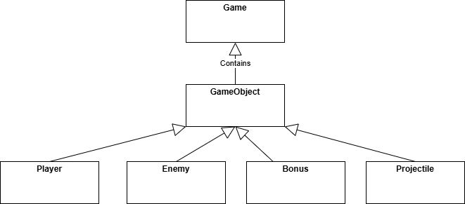
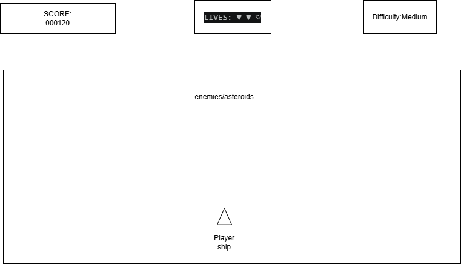

# Space Defender – Project Concept

## 1. Short Presentation of the Application

**Game type:** 2D space shooter.

The player controls a small space fighter moving within a vertically scrolling battlefield. Enemy ships appear from the top of the screen and move downward with different speeds and behaviors. The player must avoid collisions, shoot enemies, and collect bonuses that improve survivability or increase the score. The game ends when the player loses all lives.

**Characters:**
- **Player:** a maneuverable space fighter equipped with a basic laser weapon.
- **Enemies:**
  - *Standard Enemy* – slow, low health.
  - *Fast Enemy* – moves quickly and deals more damage.
  - *Tank Enemy* – slow but has high health.
- **Bonuses:**
  - *Shield* – temporary protection.
  - *Damage Boost* – increases weapon power.
  - *Health Pack* – restores player health.

**Obstacles:**
- Asteroids or space debris that move unpredictably and are difficult to destroy.

**Scenery:**
- A starfield background with animated stars and occasional planets.

**Gameplay & Controls:**
- Movement: **WASD** or **Arrow Keys**
- Shooting: **Space**
- Pause: **P**
- HUD displays: score, lives, difficulty level.

---

## 2. List of Functionalities

- **Frame-based movement:**  
  All objects update their positions every frame within the main game loop.

- **Difficulty levels loaded from file:**  
  Each difficulty preset (easy/medium/hard) is stored in a configuration file containing:
  - enemy speed
  - enemy spawn rate
  - player starting health
  - bonus spawn probability

- **Bonuses and scoring:**  
  - +10 points for destroying an enemy  
  - +5 points for collecting a bonus  
  - Player loses health when hit  
  - Game ends when health reaches zero  

- **Randomness:**  
  - Enemies spawn at random horizontal positions  
  - Enemy type chosen randomly based on difficulty  
  - Bonuses drop with a random probability  

- **Game parameterization:**  
  Config files allow adjusting:
  - enemy speed  
  - spawn frequency  
  - bonus drop rate  
  - player health  

- **Animations:**  
  - Movement animations for player and enemies  
  - Explosion animation when an object is destroyed  

- **GitHub usage:**  
  - Project stored in a dedicated repository  
  - Regular commits with meaningful messages  

---

## 3. Dummy Interface Sketch

```
[ SCORE: 000120 ]     [ LIVES: ♥ ♥ ♡ ]     [ DIFFICULTY: MEDIUM ]

--------------------------------------------------------------
|                                                            |
|                    enemies / asteroids                     |
|                                                            |
|                                                            |
|                                                            |
|                          ↑                                 |
|                       player ship                          |
|                                                            |
--------------------------------------------------------------

Main Menu:
- Start Game
- Select Difficulty
- Exit

Pause Menu:
- Paused
- Resume
- Back to Menu
```

---

## 4. Classes Diagram (Text Description)

**Game**  
- Manages the main loop  
- Loads difficulty settings  
- Stores all objects in a single container:  
  `std::vector<std::unique_ptr<GameObject>>`  
- Handles collisions, scoring, game states  

**GameObject (base class)**  
- Fields: position, speed, active flag  
- Virtual methods: `update()`, `draw()`, `onCollision()`  

**Player : public GameObject**  
- Fields: health, damage, fireCooldown  
- Methods: movement, shooting, taking damage  

**Enemy : public GameObject**  
- Fields: health, damage, enemy type  
- Methods: movement pattern, attack behavior  

**Bonus : public GameObject**  
- Fields: bonus type  
- Method: apply bonus effect to player  

**Projectile : public GameObject**  
- Fields: damage, owner (player/enemy)  
- Moves in a straight line  

**ConfigManager**  
- Loads difficulty settings from file  
- Provides parameters to `Game`  

**UIManager** (optional)  
- Draws score, lives, difficulty  

